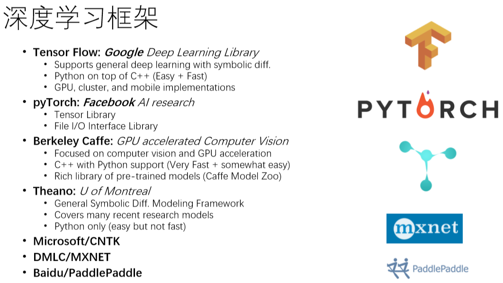

# 深入浅出：TensorFlow卷积网络与循环网络

不知道该写啥……

# TensorFlow 机器学习库

## 深度学习软硬件布局

## 深度学习框架

### 深度学习框架是什么

- 深度学习框架（Deep Learning Framework）是描述多层网络模型及训练推断的编程语言及工具类库
    - 过程式语言Python / C 不同
    - 申明式编程语言Prolog 类似
- 深度学习框架包括：
    - 编程语言，解释器，编译器
- 深度学习框架的不同，对应着编程语言内部的不同设计
    - 动态语言和静态语言的差别，对应着 TensorFlow和PyTorch 的动态计算图和静态计算图的区别

### TensorFlow深度学习框架

- TensorFlow中的“计算图”，类似对应为编译器中的 data-flow graph 或者 control-flow graph
- TensorFlow会自动对代码求导，优化未知参数，使得误差最小。可以称为一种“可求导编程语言”（differentiable programming language）
- TensorFlow的编译器XLA (Accelerated Linear Algebra) 优化TensorFlow计算图
- 在TensorFlow框架中
    - Tensor的形式有三种：constant, placeholder, variables 
    - Tensor的属性有：rank， shape，datatype
