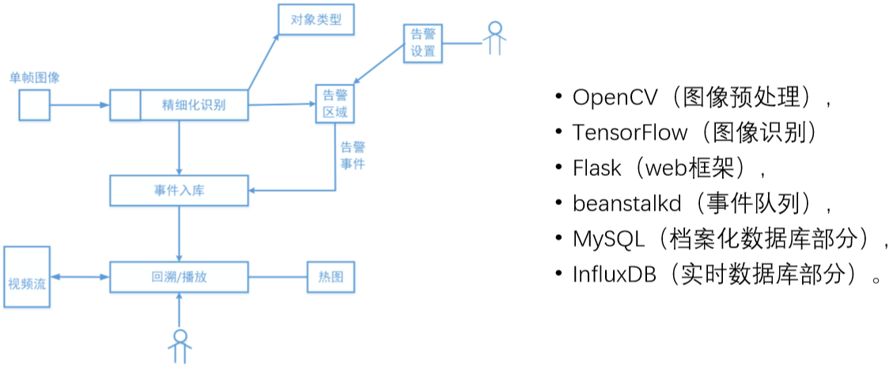

<h1>Table of Contents</h1>

<ul class="toc-item"><li><a href="#深度学习应用——计算机视觉" data-toc-modified-id="深度学习应用——计算机视觉-1">1&nbsp;&nbsp;深度学习应用——计算机视觉</a><ul class="toc-item"><li><a href="#计算机视觉的任务" data-toc-modified-id="计算机视觉的任务-1.1">1.1&nbsp;&nbsp;计算机视觉的任务</a></li><li><a href="#计算机视觉的识别指标" data-toc-modified-id="计算机视觉的识别指标-1.2">1.2&nbsp;&nbsp;计算机视觉的识别指标</a><ul class="toc-item"><li><a href="#对象检测的识别精确率指标" data-toc-modified-id="对象检测的识别精确率指标-1.2.1">1.2.1&nbsp;&nbsp;对象检测的识别精确率指标</a><ul class="toc-item"><li><a href="#平均精确率均值mAP" data-toc-modified-id="平均精确率均值mAP-1.2.1.1">1.2.1.1&nbsp;&nbsp;平均精确率均值mAP</a></li><li><a href="#PR曲线的AUC指标" data-toc-modified-id="PR曲线的AUC指标-1.2.1.2">1.2.1.2&nbsp;&nbsp;PR曲线的AUC指标</a></li><li><a href="#&quot;最佳工作状态&quot;" data-toc-modified-id="&quot;最佳工作状态&quot;-1.2.1.3">1.2.1.3&nbsp;&nbsp;"最佳工作状态"</a></li></ul></li></ul></li><li><a href="#视觉对象检测的算法" data-toc-modified-id="视觉对象检测的算法-1.3">1.3&nbsp;&nbsp;视觉对象检测的算法</a><ul class="toc-item"><li><a href="#IOU（重叠联合比）" data-toc-modified-id="IOU（重叠联合比）-1.3.1">1.3.1&nbsp;&nbsp;IOU（重叠联合比）</a></li><li><a href="#视觉对象检测的错误类型" data-toc-modified-id="视觉对象检测的错误类型-1.3.2">1.3.2&nbsp;&nbsp;视觉对象检测的错误类型</a></li><li><a href="#视觉对象检测方法" data-toc-modified-id="视觉对象检测方法-1.3.3">1.3.3&nbsp;&nbsp;视觉对象检测方法</a><ul class="toc-item"><li><a href="#R-CNN" data-toc-modified-id="R-CNN-1.3.3.1">1.3.3.1&nbsp;&nbsp;R-CNN</a></li><li><a href="#Fast-R-CNN" data-toc-modified-id="Fast-R-CNN-1.3.3.2">1.3.3.2&nbsp;&nbsp;Fast R-CNN</a></li><li><a href="#Faster-R-CNN" data-toc-modified-id="Faster-R-CNN-1.3.3.3">1.3.3.3&nbsp;&nbsp;Faster R-CNN</a></li><li><a href="#YOLO:-You-Only-Look-Once" data-toc-modified-id="YOLO:-You-Only-Look-Once-1.3.3.4">1.3.3.4&nbsp;&nbsp;YOLO: You Only Look Once</a></li><li><a href="#SSD:-Single-Shot-MultiBox-Detector" data-toc-modified-id="SSD:-Single-Shot-MultiBox-Detector-1.3.3.5">1.3.3.5&nbsp;&nbsp;SSD: Single Shot MultiBox Detector</a></li></ul></li></ul></li><li><a href="#图像语义分割的方法" data-toc-modified-id="图像语义分割的方法-1.4">1.4&nbsp;&nbsp;图像语义分割的方法</a></li></ul></li><li><a href="#PoseNet" data-toc-modified-id="PoseNet-2">2&nbsp;&nbsp;PoseNet</a></li><li><a href="#easy-helmet" data-toc-modified-id="easy-helmet-3">3&nbsp;&nbsp;easy-helmet</a></li><li><a href="#tf.data" data-toc-modified-id="tf.data-4">4&nbsp;&nbsp;tf.data</a><ul class="toc-item"><li><a href="#用tf.data读取数据" data-toc-modified-id="用tf.data读取数据-4.1">4.1&nbsp;&nbsp;用tf.data读取数据</a><ul class="toc-item"><li><a href="#用tf.data读取list" data-toc-modified-id="用tf.data读取list-4.1.1">4.1.1&nbsp;&nbsp;用tf.data读取list</a></li><li><a href="#用tf.data读取numpy数据" data-toc-modified-id="用tf.data读取numpy数据-4.1.2">4.1.2&nbsp;&nbsp;用tf.data读取numpy数据</a></li><li><a href="#利用高级API读取图片" data-toc-modified-id="利用高级API读取图片-4.1.3">4.1.3&nbsp;&nbsp;利用高级API读取图片</a></li><li><a href="#用tf.data读取TFRecord数据" data-toc-modified-id="用tf.data读取TFRecord数据-4.1.4">4.1.4&nbsp;&nbsp;用tf.data读取TFRecord数据</a></li><li><a href="#用tf.data读取文本数据" data-toc-modified-id="用tf.data读取文本数据-4.1.5">4.1.5&nbsp;&nbsp;用tf.data读取文本数据</a></li><li><a href="#用tf.data读取表格数据" data-toc-modified-id="用tf.data读取表格数据-4.1.6">4.1.6&nbsp;&nbsp;用tf.data读取表格数据</a></li></ul></li><li><a href="#减小内存开销" data-toc-modified-id="减小内存开销-4.2">4.2&nbsp;&nbsp;减小内存开销</a></li><li><a href="#打乱数据" data-toc-modified-id="打乱数据-4.3">4.3&nbsp;&nbsp;打乱数据</a></li><li><a href="#数据预处理" data-toc-modified-id="数据预处理-4.4">4.4&nbsp;&nbsp;数据预处理</a></li><li><a href="#对类别不平衡数据的处理" data-toc-modified-id="对类别不平衡数据的处理-4.5">4.5&nbsp;&nbsp;对类别不平衡数据的处理</a></li></ul></li></ul>

# 深度学习应用——计算机视觉

## 计算机视觉的任务

分类、定位、检测、分割

## 计算机视觉的识别指标

- 精确率（precision）是针对预测结果而言的，它表示的是预测为正的样本中有多少是真正的正样本。预测（分类）为正有两种可能：
    - 一种是把正类预测为正类(TP)，
    - 另一种是把负类预测为正类(FP)
- 召回率（recall）是针对原来的样本而言的，它表示的是样本中的正例有多少被预测正确了。预测（分类）为负有两种可能：
    - 一种是把原来的负类预测成负类(TN)，
    - 另一种是把原来的正类预测为负类(FN)
- 准确率(accuracy) 是指对于给定的测试数据集，分类器正确分类的样本数与总样本数之比。（也就是损失函数是0-1损失时测试数据集上的准确率）
    - 精确率(precision) = TP/(TP+FP)  
    - 召回率(recall) = TP/(TP+FN)
    - 准确率(accuracy) = (TP+TN)/(TP+FN+FP+TN) = 预测对的/所有

### 对象检测的识别精确率指标

#### 平均精确率均值mAP

- 平均精确率均值mAP（Mean Average Precision）是对象检测研究中常用数据集VOC 2007所采用的评价指标，被该领域的研究者们广泛使用
- VOC 2007对于mAP的数学定义如下，其中p和r分别表示模型在取不同的阈值参数时的精确率（Precision）和召回率（Recall）
$$
\mathrm{AP}=\frac{1}{11} \sum_{r \in\{0,0.1, \cdots, 1\}} \max _{\bar{r}: \bar{r} \geq r} p(\tilde{r})\\
\mathrm{mAP}=\frac{1}{\# \text { classes }} \sum_{c \in \text { classes }} \mathrm{AP}(c)
$$

- mAP指标度量模型在不同情况下的平均精确率，是对精确率和召回率之间平衡取舍问题的一种有效处理方式
- mAP越高，说明模型的检测准确性越好

#### PR曲线的AUC指标

-  AUC=Area under the PR Curve
- 2015年VIVA（Vision for Intelligent Vehicles and Applications）交通标志检测比赛
- VIVA主办方采用了PR曲线（Precision–Recall Curve）的面积覆盖率AUC（Area under Curve）作为对象检测的识别准确性的评价指标
- 面积覆盖率（ AUC ）越高，则对象检测的识别准确性越好

#### "最佳工作状态"

- 针对具体应用场景，对精确率和召回率之间进行一个平衡取舍，从而选择合适的阈值参数，使对象检测器处于最佳的工作状态
- F1的数学含义其实就是精确率P和召回率R的调和平均数，综合考虑了二者的影响
$$
F_{1}=\frac{2}{\frac{1}{P}+\frac{1}{R}}=\frac{2 \cdot P \cdot R}{P+R}
$$

## 视觉对象检测的算法

### IOU（重叠联合比）

- IOU_pred^truth 表示的是预测框（Prediction）和真实框（Ground Truth）之间的重叠联合比（Intersection over Union）、
- IOU定义了2个边界框（ bounding box ）(就是恰好框住对象的矩形框)的重叠度，计算为相交面积（∩）/相并面积（∪）

$$
\mathrm{IOU}_{\mathrm{pred}}^{\mathrm{truth}}=\frac{\text { Area of Intersection }}{\text { Area of Union }}
$$

### 视觉对象检测的错误类型

- 对于模型给出的检测结果，都会根据以下标准，被判定为其中的一种：
- 正确的
    - 正确（Correct）：类别正确，IOU > 0.5
- 错误的
    - 定位错误（Localization）：类别正确，0.1 < IOU < 0.5
    - 相似性错误（Similar）：类别相似，IOU > 0.1
    - 其他错误（Other）：类别错误，IOU > 0.1
    - 背景误认（Background）：IOU < 0.1

### 视觉对象检测方法

- R-CNN
    - Region based convolutional networks for accurate object detection and segmentation, TPAMI, 2015.
    - Rich feature hierarchies for accurate object detection and semantic segmentation, CVPR 2014.
- Fast R-CNN
    - Fast R-CNN, ICCV 2015.
- Faster R-CNN
    - Faster R-CNN, NIPS, 2015.
- YOLOv1-->YOLOv3
    - You Only Look Once: Unified, Real-Time Object Detection, CVPR 2016.
- SSD
    - SSD: Single Shot MultiBox Detector, ECCV 2016.

#### R-CNN

- 输入图像，提取提炼区域（region）：
    - 用选择性搜索（selective search）的算法去搜索一个‘fast mode’(快速模式) ，对每一个提出的可能有对象的图像区域提取出一个4096维的特征向量。
    - 对于不是标准227*227像素的正方形的区域，使其标准化。最简单的方法是膨胀（dilate，形态学算法）其最小外边框（设宽度=16 pixels），使整幅图像大小合适。
- 计算CNN特征：
    - CNN网络架构： 5个卷积层（Convolution Layers），2个全连接(Fully Connected Layers), 正如Yann Le Cun之前提出的LeNet算法。
- 区域分类：
    - 对每一个类预先训练好一个支持向量机（SVM），然后对之前提炼出来的特征向量（feature vector）用对应类的SVM去“打分”。
    - 贪心思想的“非极大值抑制”(non-maximum suppression)算法：如果一个区域和一个有更高打分的区域有交集（Intersection-over-Union （IoU））并且IoU的值>某个阈值，那么这个区域（得分相对低的）将被舍弃。

##### 缺点

- 训练分为3个步骤的流水线（对候选区提取特征的微调卷积网络，训练线性SVM作为对象探测器，处理proposal计算卷积特征，边界框（BBOX）回归运算）；
 - 训练时间和空间开销大。要从每一张图像上提取大量proposal，还要从每个proposal中提取特征，并存到磁盘中；
- 测试时间开销大。要从每个测试图像上，提取大量proposal，再从每个proposal中提取特征来进行检测过程；
- 速度慢。一个原因是在前向运算时对每一个候选区域的对象分别计算，并没有用共享权值或共享模型参数的方法加快。

#### Fast R-CNN

- 使用外部算法（选择性搜索SS ）来找出候选区域（2000个object proposal），找出感兴趣的区域（Regions of Interest, RoI），映射到特征空间里；
- 缩放图片的scale得到图片金字塔，得到conv5的特征金字塔；
- 对于每个scale的每个ROI，求取映射关系，在conv5中crop出对应的patch；并用一个单层的空间金字塔池化层（SPP） layer（称为Rol pooling layer）来统一到一样的尺度，因为后续的全连接层输入的所有向量有同样的大小；
- 连续续经过两个全连接层得到特征，特征又分别共享到到两个新的全连接层，分别对应两个优化目标
    - 第一个优化目标是分类，使用softmax，
    - 第二个优化目标是边界框回归（bbox regression），使用了一个smooth的L1-loss（一次函数和小量时二次函数的结合）。

#### Faster R-CNN

- Faster RCNN可以简单地看做“RPN+fast R-CNN“的系统，用RPN代替fast R-CNN中的Selective Search方法
- Faster R-CNN包含2个模块：
    - RPN(Region Proposal Network): 在深度卷积层基础上给出一系列的矩形候选区域。
    - Fast R-CNN RoI 池化层：对每个proposal 区域进行分类，提取proposal定位。
- 主要思想是用最后一个卷积层去推断候选区域。

#### YOLO: You Only Look Once

- YOLO算法将对目标检测任务的认识由分类问题（Classification）化简为回归问题（Regression）
- 在保证精度不过多损失的前提下，极大地提高了检测速度
- 运算速度高，在Titan X GPU上的运行速度可以达到45 FPS（实时）

#### SSD: Single Shot MultiBox Detector

- SSD方法的核心：
    - 预测对象（ predict object ）及其归属类别的score（得分）
    - 在 feature map上使用小的卷积核去predict一系列bounding boxes的box offsets
- 为了得到高精度的检测结果：
    - 在不同层次的 feature maps（特征图谱）上去 predict object、box offsets，
    - 得到不同aspect ratio（纵横比）的predictions。
- 改进设计：
    - 能够在当输入分辨率较低的图像时，保证检测的精度。
    - 整体端到端（end-to-end）的设计，训练也变得简单。
    - 在检测速度、检测精度之间取得较好的折衷。
- SSD，比YOLOv1方法，还要快，还要精确。
- SSD，在保证速度的同时，mAP指标与使用region proposals 技术的方法（如 Faster R-CNN）相媲美

## 图像语义分割的方法

- TensorMask and Mask R-CNN

# PoseNet

姿势判断在上层分成两个阶段进⾏：
1. 输⼊ RGB 图像，通过卷积神经⽹络馈送。
2. 单⼀姿势或多姿势解码算法：⽤于从模型输出解码姿势，姿势置信度得分， 关键点位置和关键点置信度得分。

# easy-helmet

母鸡要改啥

# tf.data

## 用tf.data读取数据

### 用tf.data读取list

`tf.data.Dataset.from_tensor_slices`

### 用tf.data读取numpy数据

`tf.data.Dataset.from_tensor_slices`

### 利用高级API读取图片

`tf.keras.preprocessing.image.ImageDaataGenerator`

### 用tf.data读取TFRecord数据

`tf.data.Dataset.from_generator`

### 用tf.data读取文本数据

`tf.data.TextLineDataset`

### 用tf.data读取表格数据

`tf.data.experimental.mak_csv_dataset`

## 减小内存开销

`tf.data.Dataset.from_generator`

## 打乱数据

`dataset.shuffle`

## 数据预处理

`dataset.map`

## 对类别不平衡数据的处理

`tf.data.experimental.sample_from_datasets`

`tf.data.experimental.rejection_resample`
