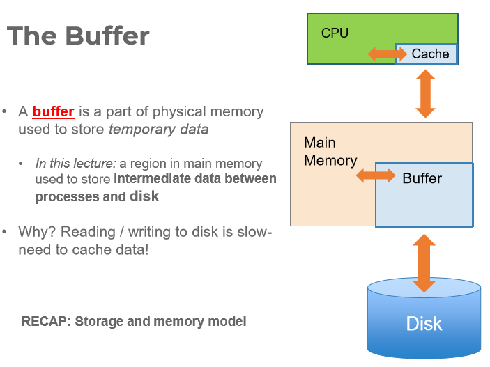
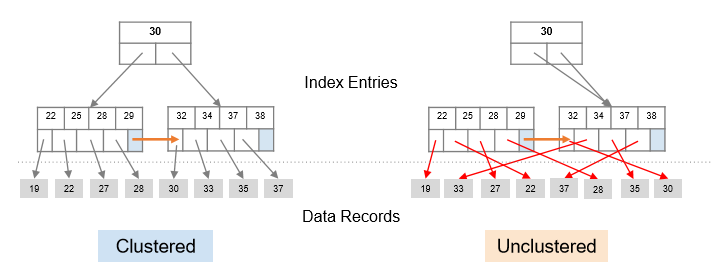

<h1>Table of Contents<span class="tocSkip"></span></h1>
<div class="toc"><ul class="toc-item"><li><span><a href="#数据库进阶" data-toc-modified-id="数据库进阶-1"><span class="toc-item-num">1&nbsp;&nbsp;</span>数据库进阶</a></span><ul class="toc-item"><li><span><a href="#变量指代模糊问题" data-toc-modified-id="变量指代模糊问题-1.1"><span class="toc-item-num">1.1&nbsp;&nbsp;</span>变量指代模糊问题</a></span></li><li><span><a href="#合并搜索方法" data-toc-modified-id="合并搜索方法-1.2"><span class="toc-item-num">1.2&nbsp;&nbsp;</span>合并搜索方法</a></span></li><li><span><a href="#Set-Operators" data-toc-modified-id="Set-Operators-1.3"><span class="toc-item-num">1.3&nbsp;&nbsp;</span>Set Operators</a></span><ul class="toc-item"><li><span><a href="#INTERSECT：交集" data-toc-modified-id="INTERSECT：交集-1.3.1"><span class="toc-item-num">1.3.1&nbsp;&nbsp;</span>INTERSECT：交集</a></span></li><li><span><a href="#UNION：并集" data-toc-modified-id="UNION：并集-1.3.2"><span class="toc-item-num">1.3.2&nbsp;&nbsp;</span>UNION：并集</a></span></li><li><span><a href="#UNION-ALL：并集且生成Multiset" data-toc-modified-id="UNION-ALL：并集且生成Multiset-1.3.3"><span class="toc-item-num">1.3.3&nbsp;&nbsp;</span>UNION ALL：并集且生成Multiset</a></span></li><li><span><a href="#Nested-queries：嵌入查询，知道查询的结果也是一个table应该就会用了吧" data-toc-modified-id="Nested-queries：嵌入查询，知道查询的结果也是一个table应该就会用了吧-1.3.4"><span class="toc-item-num">1.3.4&nbsp;&nbsp;</span>Nested queries：嵌入查询，知道查询的结果也是一个table应该就会用了吧</a></span></li></ul></li><li><span><a href="#Aggregation：统计操作" data-toc-modified-id="Aggregation：统计操作-1.4"><span class="toc-item-num">1.4&nbsp;&nbsp;</span>Aggregation：统计操作</a></span></li><li><span><a href="#其他tips" data-toc-modified-id="其他tips-1.5"><span class="toc-item-num">1.5&nbsp;&nbsp;</span>其他tips</a></span></li></ul></li><li><span><a href="#Indexing-IO-model-External-Merge-External-Merge-Sort" data-toc-modified-id="Indexing-IO-model-External-Merge-External-Merge-Sort-2"><span class="toc-item-num">2&nbsp;&nbsp;</span>Indexing-IO model-External Merge-External Merge Sort</a></span><ul class="toc-item"><li><span><a href="#Index" data-toc-modified-id="Index-2.1"><span class="toc-item-num">2.1&nbsp;&nbsp;</span>Index</a></span><ul class="toc-item"><li><span><a href="#定义" data-toc-modified-id="定义-2.1.1"><span class="toc-item-num">2.1.1&nbsp;&nbsp;</span>定义</a></span></li><li><span><a href="#对索引的操作" data-toc-modified-id="对索引的操作-2.1.2"><span class="toc-item-num">2.1.2&nbsp;&nbsp;</span>对索引的操作</a></span></li></ul></li><li><span><a href="#IO-Model" data-toc-modified-id="IO-Model-2.2"><span class="toc-item-num">2.2&nbsp;&nbsp;</span>IO Model</a></span><ul class="toc-item"><li><span><a href="#Storage-and-memory-model" data-toc-modified-id="Storage-and-memory-model-2.2.1"><span class="toc-item-num">2.2.1&nbsp;&nbsp;</span>Storage and memory model</a></span></li><li><span><a href="#The-Buffer" data-toc-modified-id="The-Buffer-2.2.2"><span class="toc-item-num">2.2.2&nbsp;&nbsp;</span>The Buffer</a></span><ul class="toc-item"><li><span><a href="#The-(Simplified)-Buffer" data-toc-modified-id="The-(Simplified)-Buffer-2.2.2.1"><span class="toc-item-num">2.2.2.1&nbsp;&nbsp;</span>The (Simplified) Buffer</a></span></li><li><span><a href="#Managing-Disk:-The-DBMS-Buffer" data-toc-modified-id="Managing-Disk:-The-DBMS-Buffer-2.2.2.2"><span class="toc-item-num">2.2.2.2&nbsp;&nbsp;</span>Managing Disk: The DBMS Buffer</a></span></li></ul></li></ul></li><li><span><a href="#External-Merge-Algorithm" data-toc-modified-id="External-Merge-Algorithm-2.3"><span class="toc-item-num">2.3&nbsp;&nbsp;</span>External Merge Algorithm</a></span><ul class="toc-item"><li><span><a href="#合并大有序序列" data-toc-modified-id="合并大有序序列-2.3.1"><span class="toc-item-num">2.3.1&nbsp;&nbsp;</span>合并大有序序列</a></span></li><li><span><a href="#合并大文件" data-toc-modified-id="合并大文件-2.3.2"><span class="toc-item-num">2.3.2&nbsp;&nbsp;</span>合并大文件</a></span></li><li><span><a href="#优化：有B+1-buffer-pages的情况" data-toc-modified-id="优化：有B+1-buffer-pages的情况-2.3.3"><span class="toc-item-num">2.3.3&nbsp;&nbsp;</span>优化：有B+1 buffer pages的情况</a></span><ul class="toc-item"><li><span><a href="#Increase-the-length-of-initial-runs" data-toc-modified-id="Increase-the-length-of-initial-runs-2.3.3.1"><span class="toc-item-num">2.3.3.1&nbsp;&nbsp;</span>Increase the length of initial runs</a></span></li><li><span><a href="#B-way-merges" data-toc-modified-id="B-way-merges-2.3.3.2"><span class="toc-item-num">2.3.3.2&nbsp;&nbsp;</span>B-way merges</a></span></li><li><span><a href="#Repacking" data-toc-modified-id="Repacking-2.3.3.3"><span class="toc-item-num">2.3.3.3&nbsp;&nbsp;</span>Repacking</a></span></li></ul></li></ul></li></ul></li><li><span><a href="#B+tree-again" data-toc-modified-id="B+tree-again-3"><span class="toc-item-num">3&nbsp;&nbsp;</span>B+tree again</a></span><ul class="toc-item"><li><span><a href="#Index-Types" data-toc-modified-id="Index-Types-3.1"><span class="toc-item-num">3.1&nbsp;&nbsp;</span>Index Types</a></span></li><li><span><a href="#B+-Trees" data-toc-modified-id="B+-Trees-3.2"><span class="toc-item-num">3.2&nbsp;&nbsp;</span>B+ Trees</a></span><ul class="toc-item"><li><span><a href="#Terminologies" data-toc-modified-id="Terminologies-3.2.1"><span class="toc-item-num">3.2.1&nbsp;&nbsp;</span>Terminologies</a></span></li><li><span><a href="#Searching-a-B+-Tree" data-toc-modified-id="Searching-a-B+-Tree-3.2.2"><span class="toc-item-num">3.2.2&nbsp;&nbsp;</span>Searching a B+ Tree</a></span></li><li><span><a href="#B+-Tree-Design" data-toc-modified-id="B+-Tree-Design-3.2.3"><span class="toc-item-num">3.2.3&nbsp;&nbsp;</span>B+ Tree Design</a></span></li><li><span><a href="#B+-Tree:-High-Fanout-=-Smaller-&amp;-Lower-IO" data-toc-modified-id="B+-Tree:-High-Fanout-=-Smaller-&amp;-Lower-IO-3.2.4"><span class="toc-item-num">3.2.4&nbsp;&nbsp;</span>B+ Tree: High Fanout = Smaller &amp; Lower IO</a></span></li><li><span><a href="#Simple-Cost-Model-for-Search" data-toc-modified-id="Simple-Cost-Model-for-Search-3.2.5"><span class="toc-item-num">3.2.5&nbsp;&nbsp;</span>Simple Cost Model for Search</a></span></li><li><span><a href="#Fast-Insertions-&amp;-Self-Balancing" data-toc-modified-id="Fast-Insertions-&amp;-Self-Balancing-3.2.6"><span class="toc-item-num">3.2.6&nbsp;&nbsp;</span>Fast Insertions &amp; Self-Balancing</a></span></li><li><span><a href="#Clustered-Indexes聚簇索引" data-toc-modified-id="Clustered-Indexes聚簇索引-3.2.7"><span class="toc-item-num">3.2.7&nbsp;&nbsp;</span>Clustered Indexes聚簇索引</a></span></li></ul></li></ul></li><li><span><a href="#Indexes-in-SQL" data-toc-modified-id="Indexes-in-SQL-4"><span class="toc-item-num">4&nbsp;&nbsp;</span>Indexes in SQL</a></span></li><li><span><a href="#Big-Scaling-with-Indexes：Hashing-Sorting-Couting" data-toc-modified-id="Big-Scaling-with-Indexes：Hashing-Sorting-Couting-5"><span class="toc-item-num">5&nbsp;&nbsp;</span>Big Scaling with Indexes：Hashing-Sorting-Couting</a></span></li><li><span><a href="#TensorFlow" data-toc-modified-id="TensorFlow-6"><span class="toc-item-num">6&nbsp;&nbsp;</span>TensorFlow</a></span><ul class="toc-item"><li><span><a href="#预备知识" data-toc-modified-id="预备知识-6.1"><span class="toc-item-num">6.1&nbsp;&nbsp;</span>预备知识</a></span></li></ul></li></ul></div>
# 数据库进阶

## 变量指代模糊问题

注明即可

## 合并搜索方法

- inner join：只显示两边都有的
- left outer join：左边有右边没有的，对应属性填null
- right outer join：右边有左边没有的，对应属性填null
- full outer join：并集，没有的对应属性填null

## Set Operators

- Set: Only has unique elements
- Multiset: Can has duplicate elements

### INTERSECT：交集

### UNION：并集

### UNION ALL：并集且生成Multiset

### Nested queries：嵌入查询，知道查询的结果也是一个table应该就会用了吧

## Aggregation：统计操作

- SUM
- COUNT
- MIN
- MAX
- AVG

例：
```
SELECT AVG(price)
FROM   Product
WHERE  maker = “Toyota”
```

- HAVING对统计量进行操作，WHERE对行进行操作

例：
```
SELECT      S
FROM         R1,…,Rn
WHERE      C1
GROUP BY a1,…,ak
HAVING      C2
```

## 其他tips

- CREAT之前都先记得DROP * IF EXISTS *
- NULL（显示为None）会被单独处理，无法从比较中返回TRUE值，只能 IS NULL

# Indexing-IO model-External Merge-External Merge Sort

## Index

### 定义

`index`是一种数据结构，建立搜索关键词到表中数行的集合的映射。

`index`可以存储：

1. 它指向的整行（主索引）；或是
2. 指向行的指针（次索引）（更常用）

### 对索引的操作

1. 搜索 Search
2. 插入/移除 Insert/Remove

## IO Model

### Storage and memory model

|Random Access Memory (RAM) or Main Memory|Disk|
|:-|:-|
|**Fast**: Random access, byte addressable <br />~10x faster for <u>sequnential access</u>  <br />~100,000x faster for <u>random access</u>|**Slow**: Sequential block access Read a blocks (not byte) at a time, so sequential access is cheaper than random<br />Disk read / writes are expensive!|
|**Volatile**: Data can be lost if e.g. crash occurs, power goes out, etc!|**Durable**: We will assume that once on disk, data is safe!|
|**Expensive**: For $100, get 16GB of RAM vs. 2TB of disk!|**Cheap**|

### The Buffer



- page: fixed-sized array of memory
- file: a variable-length list of pages

#### The (Simplified) Buffer

Buffer located in main memory operates over pages and files:

- **Read(page)**: Read page from disk  -->  buffer if not already in buffer
- **Flush(page)**: Evict page from buffer & write to disk, if dirty (dirty ⇒ modified page)
- **Release(page)**: Evict page from buffer without writing to disk

#### Managing Disk: The DBMS Buffer

## External Merge Algorithm

### 合并大有序序列

对于两个有序序列，如何用尽可能少的内存空间做合并（Merge）操作？——External Merge Algorithm

利用序列的有序性，分别从小比到大就行。If lists of size M and N, then Cost: 2(M+N) IOs, Each page is read once, written once

**With B+1 buffer pages, can merge B lists.**

### 合并大文件

同样地，Sort Big Files with Small Memory——External Merge Algorithm: 

1. Split into chunks small enough to sort in memory (“runs”)
2. Merge pairs (or groups) of runs with external merge algorithm
3. Keep merging the resulting runs (each time = a “pass”) until left with one sorted file!

对于3-page buffer的情况，共需要$2N\times[(\log_2 N)+1]$的总IO操作

### 优化：有B+1 buffer pages的情况

#### Increase the length of initial runs

$2N[(\log_2 N)+1]\to 2N\left[\left(\log_2\frac{N}{B+1}\right)+1\right]$

#### B-way merges

$2N[(\log_2 N)+1]\to 2N\left[\left(\log_2\frac{N}{B+1}\right)+1\right]\to 2N\left[\left(\log_B\frac{N}{B+1}\right)+1\right]$

#### Repacking

$2N[(\log_2 N)+1]\to 2N\left[\left(\log_2\frac{N}{B+1}\right)+1\right]\to 2N\left[\left(\log_B\frac{N}{B+1}\right)+1\right]\to 2N\left[\left(\log_B\frac{N}{2\left(B+1\right)}\right)+1\right]$

# B+tree again

## Index Types

- B-Trees (covered next)
    - Very good for range queries, sorted data
    - Some old databases only implemented B-Trees
    - We will look at a variant called ***B+ Trees***
- Hash Tables
    - There are variants of this basic structure to deal with IO
    - Called ***linear*** or ***extendible hashing-*** IO aware!

## B+ Trees

- Search trees
    - B does not mean binary!
- Idea in B Trees: 
    - make 1 node = 1 physical page
    - Balanced, height adjusted tree (not the B either)
- Idea in B+ Trees:
    - Make leaves into a linked list (for range queries)

### Terminologies

- Parameter ***d*** = the degree
    - Each *non-leaf("interior")* ***node*** has $\ge$ d and $\le$ 2d ***keys***
    - except for root node, which can have between **1** and 2d keys
- The n keys in a node define n+1 ranges
    - For each range, in a non-leaf node, there is a **pointer** to another node with keys in that range
- Leaf nodes also have between *d* and *2d* keys, and are different in that:
    - Their key slots（键槽） contain pointers to data records
    - They contain a pointer to the next leaf node as well, ***for faster sequential traversal***

### Searching a B+ Tree

- For exact key values:
    - Start at the root
    - Proceed down, to the leaf
- For range queries: 
    - As above 
    - *Then sequential traversal*

### B+ Tree Design

- How large is ***d***?
- Example:
    - Key size = 4 bytes 
    - Pointer size = 8 bytes
    - Block size = 64k bytes
- We want each node to fit on a single block/page: 2d x 4  + (2d+1) x 8  <=  64k → d ~= 2730 

### B+ Tree: High Fanout = Smaller & Lower IO

The <u>**fanout**</u> is defined as the number of pointers to child nodes coming out of a node

<u>**Fill-factor**</u> is the percent of available slots in the B+ Tree that are filled; is usually < 1 to leave slack for (quicker) insertions

- As compared to e.g. binary search trees, B+ Trees have **high fanout** (***between d+1 and 2d+1***)
- Hence the **depth of the tree is small** → getting to any element requires very few IO operations!
    - Also can often store most/all of B+ Tree in RAM!
- A TiB = 240 Bytes.  What is the height of a B+ Tree (with fill-factor = 1) that indexes it (with 64K pages)? 
    - (2\*2730 + 1)h = 240 → ***h = 4***

### Simple Cost Model for Search

- Exact Search
    - $\left[\log_f \frac{N}{F}\right]$：B+ Tree高度
    - $-L_B$：能放在内存buffer里的不用读，$B\ge \sum_{l=0}^{L_B-1}f^l$
    - 1：读出那个数儿
- range Search
    - $\left[\log_f \frac{N}{F}\right]$：B+ Tree高度
    - $-L_B$：能放在内存buffer里的不用读，$B\ge \sum_{l=0}^{L_B-1}f^l$
    - $Cost(OUT)$：装载额外的leaf nodes+装载结果的***page***

### Fast Insertions & Self-Balancing

- **~ Same cost as exact search**
- ***Self-balancing***: B+ Tree remains **balanced** (with respect to height) even after insert

### Clustered Indexes聚簇索引

An index is <u>***clustered***</u> if the underlying data is ordered in the same way as the index’s data entries.



**Clustered vs. Unclustered Index**
- Recall that for a disk with block access, sequential IO is much faster than random IO
- For exact search, no difference between clustered / unclustered
- For range search over R values: difference between 1 random IO + R sequential IO, and R random IO: 
    - A random IO costs ~ 10ms (sequential much much faster)
    - For R = 100,000 records- difference between ~10ms and ~17min!

# Indexes in SQL

- Indexing
    - with Hashing
    - with B Tree
- Two alternatives
    - first search key
    - secondary search key
- Index Definition in SQL:
    - `Create index name on rel (attr)`
    - `Create unique index name on rel (attr)`
    - `Drop INDEX name`
    - `CREATE INDEX foo ON R(A,B,C)`(MULTIKEY INDEX)

# Big Scaling with Indexes：Hashing-Sorting-Couting

？

# TensorFlow

## 预备知识

- 即时执行(Eager Execution)，计算图(Graph)，会话(Session)
- Tensor
    - Constant, Placeholder, Variable 三种表现形式
    - reshape, rank 操作
